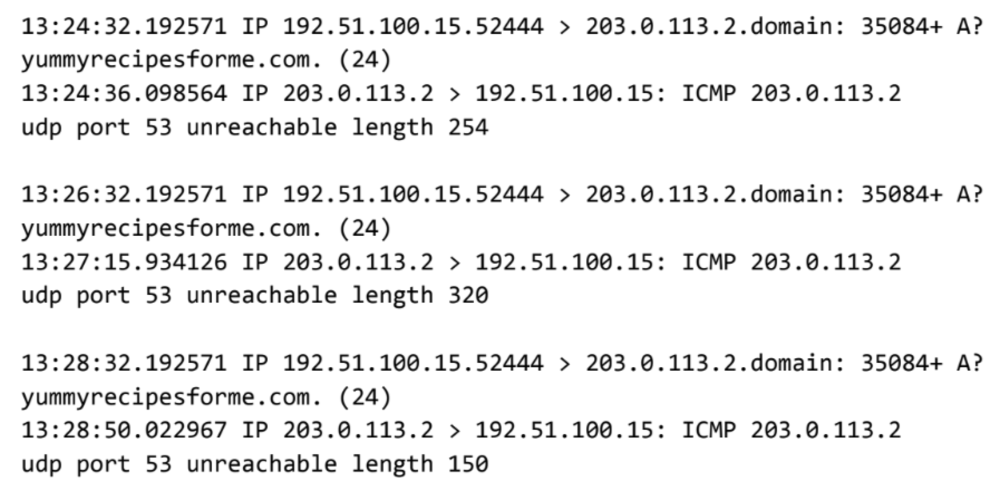

# Cybersecurity Incident Report
## tcpdump Network Traffic Analysis — DNS Port Unreachable

| Field | Detail |
|-------|--------|
| **Analyst** | Amal Shaji |
| **Date of Incident** | [Date] |
| **Time of Incident** | 13:24 |
| **Affected Website** | www.yummyrecipesforme.com |
| **Tool Used** | tcpdump |
| **Protocols Involved** | UDP, ICMP, DNS |

---

## Incident Summary

Multiple customers reported being unable to access 
`www.yummyrecipesforme.com`, consistently receiving a 
"destination port unreachable" error after the page failed 
to load. The issue was escalated to the cybersecurity team 
for investigation.

To begin the investigation, access to the website was 
attempted directly — the same error was reproduced, 
confirming the issue was active and consistent. tcpdump 
was deployed as a network analyser to capture live traffic 
while the webpage load was reattempted. The resulting log 
output forms the basis of this report.

---

## Raw tcpdump Log

The following output was captured during the investigation:



**Log breakdown:**

| Timestamp | Source | Destination | Event |
|-----------|--------|-------------|-------|
| 13:24:32.192571 | 192.51.100.15.52444 | 203.0.113.2.domain | UDP DNS query — `yummyrecipesforme.com` (Query ID: 35084+, Flag: A?) |
| 13:24:36.098564 | 203.0.113.2 | 192.51.100.15 | ICMP error — `udp port 53 unreachable` length 254 |
| 13:26:32.192571 | 192.51.100.15.52444 | 203.0.113.2.domain | UDP DNS query — `yummyrecipesforme.com` (Query ID: 35084+, Flag: A?) |
| 13:27:15.934126 | 203.0.113.2 | 192.51.100.15 | ICMP error — `udp port 53 unreachable` length 320 |
| 13:28:32.192571 | 192.51.100.15.52444 | 203.0.113.2.domain | UDP DNS query — `yummyrecipesforme.com` (Query ID: 35084+, Flag: A?) |
| 13:28:50.022967 | 203.0.113.2 | 192.51.100.15 | ICMP error — `udp port 53 unreachable` length 150 |

The same pattern repeated consistently across all three 
captured log events — every outbound DNS query was met 
with an ICMP error response. No successful DNS resolution 
was observed at any point during the capture session.

---

## Traffic Analysis

When a user visits a website, the browser initiates the 
following sequence:

1. Sends a **UDP packet to port 53** on the DNS server 
requesting resolution of the domain name into an IP address
2. Uses the returned IP address to send an **HTTPS request** 
to the web server to load the page

In this case, step 1 never completed successfully. Every 
UDP DNS query sent to the DNS server at `203.0.113.2` 
returned an **ICMP error packet** with the message:
```
udp port 53 unreachable
```

Two additional indicators in the log confirm DNS operations 
were failing before the ICMP error was returned:

- **Query ID 35084+** — the plus sign indicates flags 
present on the outgoing UDP message, signalling the query 
did not complete cleanly
- **A?** — this symbol indicates flags associated with the 
DNS A record lookup operation itself, further confirming 
the DNS resolution process was not functioning correctly

Without a successful DNS resolution, no IP address could 
be retrieved for `yummyrecipesforme.com` and no connection 
to the web server could be established — producing the 
"destination port unreachable" error reported by customers.

---

## Findings

**Affected protocol:** DNS (via UDP port 53)

Port 53 is the standard port for DNS protocol traffic. An 
ICMP error reporting port 53 as unreachable directly 
confirms a failure at the DNS layer. The pattern was 
consistent — three separate DNS queries across a four 
minute window all returned the same ICMP error — indicating 
this was not a transient issue but a sustained DNS service 
failure.

---

## Root Cause Analysis

Two probable root causes were identified based on the 
evidence captured:

**1. DNS server is unavailable**
The DNS server at `203.0.113.2` may have become 
unavailable due to a Denial of Service attack targeting 
the server directly, or due to an internal misconfiguration 
causing the DNS service to stop responding on port 53.

**2. Port 53 blocked at the firewall**
A firewall rule — whether intentionally or accidentally 
applied — may be blocking UDP traffic on port 53, 
preventing DNS queries from reaching the server even if 
the server itself is operational. This would produce 
identical ICMP error responses to a server being fully 
down.

---

## Recommended Next Steps

1. **Verify DNS server status** — check whether the DNS 
server at `203.0.113.2` is running and responsive on 
port 53. If the service is down, review server logs for 
the period preceding 13:24 to identify the cause
2. **Audit firewall rules** — review current firewall 
configuration for any rules blocking UDP port 53 traffic 
inbound or outbound. Remediate immediately if a 
misconfiguration is found
3. **Check for DoS indicators** — if server logs show 
an abnormal spike in traffic volume targeting port 53 
prior to the outage, treat this as a potential DoS attack 
and initiate the appropriate incident response procedure
4. **Restore DNS service** — once root cause is 
confirmed, restore the DNS server or unblock port 53 
as appropriate. Verify domain resolution for 
`yummyrecipesforme.com` is functioning before closing 
the incident
5. **Post-incident review** — document the full incident 
timeline, confirmed root cause, and resolution steps. 
Review DNS server and firewall configurations to 
implement controls preventing recurrence

---

*Report completed by Amal Shaji — Google Cybersecurity 
Professional Certificate, Course 3: Connect and Protect: 
Networks and Network Security*
