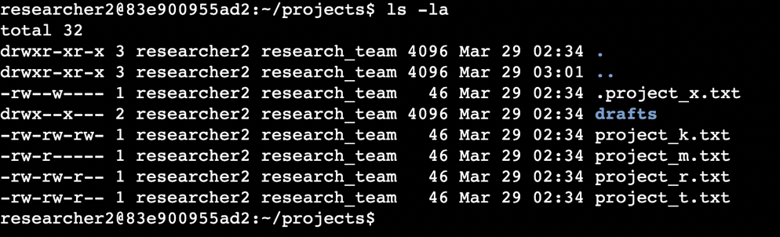
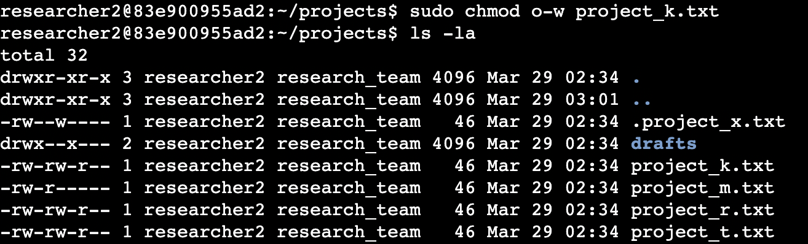
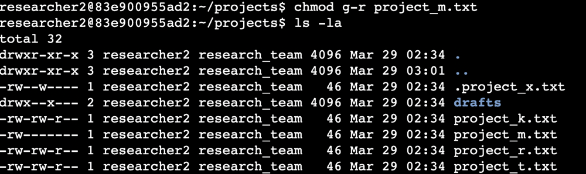
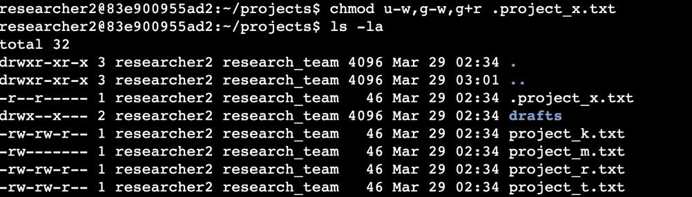
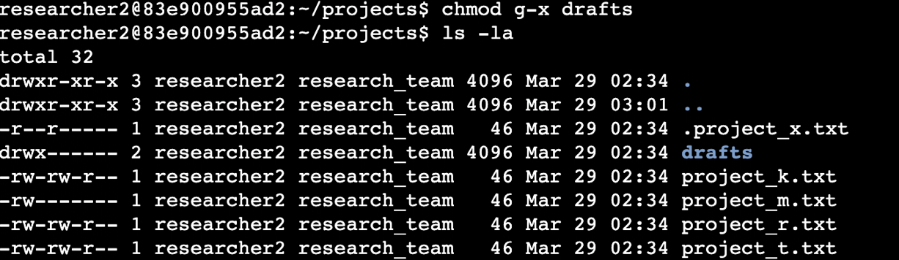

# File Permissions Management 
## Managing Authorization 

| Field | Detail |
|-------|--------|
| **Analyst** | Amal Shaji |
| **Environment** | Linux CLI |
| **Commands Used** | ls -la, chmod |
| **Objective** | Examine and update file system permissions to ensure users are authorised appropriately |

---

## Project Description

As a security professional working with a research team at a 
large organisation, part of the role involves ensuring that 
users have the correct permissions on the file system — no 
more and no less than what their role requires. This directly 
supports the principle of least privilege, a core security 
control that limits access to only what is necessary for each 
user to perform their job.

This lab involves examining existing permissions on the file 
system, determining whether they match the intended 
authorisation levels, and using `chmod` to correct any 
mismatches — removing unauthorised access and granting 
appropriate permissions where missing.

---

## Understanding the 10-Character Permission String

Before modifying permissions, it is essential to correctly 
interpret what the existing permissions show. Every file and 
directory in Linux displays a 10-character permission string 
when viewed with `ls -la`.
```
-rwxr-xr--
```

| Position | Character | Meaning |
|----------|-----------|---------|
| 1 | `-` or `d` | File type — `-` = file, `d` = directory |
| 2–4 | `rwx` | Owner permissions — read, write, execute |
| 5–7 | `r-x` | Group permissions — read, write, execute |
| 8–10 | `r--` | Other permissions — read, write, execute |

Each position uses:
- `r` — read permission granted
- `w` — write permission granted
- `x` — execute permission granted
- `-` — permission not granted

Misinterpreting this string leads to incorrect permission 
changes — which can either leave vulnerabilities open or 
break legitimate access. Reading it accurately is the 
first step before any modification.

---

## Step 1 — Check Existing File and Directory Permissions

The first step is to examine the current state of 
permissions across the file system using `ls -la`.


```bash
ls -la
```

The `-l` flag displays the long format — showing the 
permission string, ownership, file size, and last 
modification date for every item. The `-a` flag ensures 
hidden files are included in the output. Hidden files 
begin with a `.` prefix and are not shown by a standard 
`ls` command.

This step establishes the baseline — what permissions 
currently exist before any changes are made. Every 
permission modification decision in the following steps 
is based on what this output reveals.

---

## Step 2 — Change Read Permission on project_m.txt



After reviewing the existing permissions, the read 
permission on `project_m.txt` required adjustment to 
match the correct authorisation level for this file.

The `chmod` command modifies permissions using the 
following syntax:
```bash
chmod [who][operator][permission] filename
```

| Symbol | Meaning |
|--------|---------|
| `u` | User — the file owner |
| `g` | Group |
| `o` | Other — all other users |
| `a` | All — user, group, and other |
| `+` | Add permission |
| `-` | Remove permission |
| `=` | Set exact permission |

Adjusting read permissions ensures that only authorised 
users can view the contents of sensitive research files, 
directly supporting the organisation's access control 
requirements.

---

## Step 3 — Remove Write Permission from User and Group,
## Add Read Permission to Group



The existing permissions on this file granted write access 
to both the user and the group — broader than what the 
research team's authorisation level requires. Write 
permission was removed from both, and read permission 
was added to the group to reflect the correct access level.

Multiple permission changes were applied in a single 
command:
```bash
chmod u-w,g-w,g+r filename
```

This command:
- Removes write permission from the user (`u-w`)
- Removes write permission from the group (`g-w`)
- Adds read permission to the group (`g+r`)

Combining changes in a single command ensures all 
modifications are applied together, reducing the risk 
of leaving the file in an intermediate insecure state 
between separate commands.

---

## Step 4 — Change Execute Permission on drafts Directory



Execute permission on a directory controls whether a 
user can navigate into it and access its contents. 
Without execute permission on a directory, a user 
cannot `cd` into it regardless of any read permission 
they may hold.
```bash
chmod u+x drafts
```

This added execute permission for the owner on the 
`drafts` directory, granting the appropriate level of 
access for the research team member responsible for 
managing draft files while maintaining restrictions 
for other users.

---

## Step 5 — Review Hidden Files



Hidden files — those beginning with a `.` prefix — do 
not appear in a standard `ls` output. The `-a` flag 
reveals them:
```bash
ls -la
```

From a security perspective, hidden files must not be 
overlooked during a permissions review. They are only 
hidden from casual directory listings — not from users 
with appropriate access permissions. Any hidden file 
with incorrect permissions represents the same risk as 
a visible file with the same misconfiguration.

All hidden files identified were reviewed and their 
permissions were verified against the authorisation 
requirements for the research team.

---

## Summary

This lab examined existing file system permissions for 
a research team and applied targeted modifications to 
align them with correct authorisation levels. The 
following actions were completed:

- Used `ls -la` to review all file and directory 
permissions including hidden files
- Interpreted the 10-character permission string to 
accurately assess current access levels
- Used `chmod` to adjust read, write, and execute 
permissions across multiple files and directories
- Removed unauthorised write access from user and 
group where permissions exceeded what the role requires
- Verified hidden files were included in the 
permissions review

Correct permission management is a direct application 
of the principle of least privilege. Ensuring users 
have only the access they need — and no more — reduces 
the attack surface and limits the potential damage from 
compromised accounts or insider threats.

---

*Completed by Amal Shaji — Google Cybersecurity Professional
Certificate, Course 4: Tools of the Trade: Linux and SQL*
