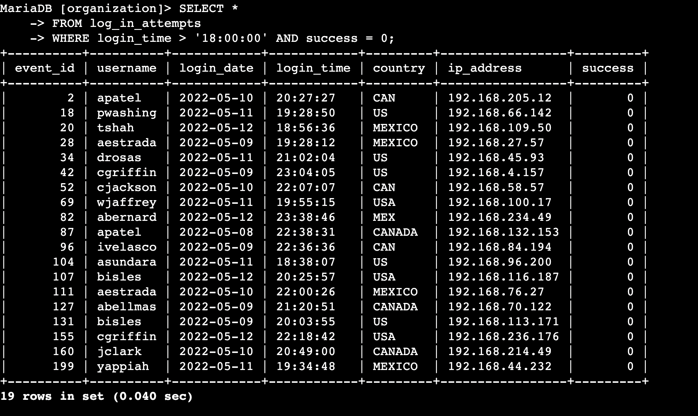
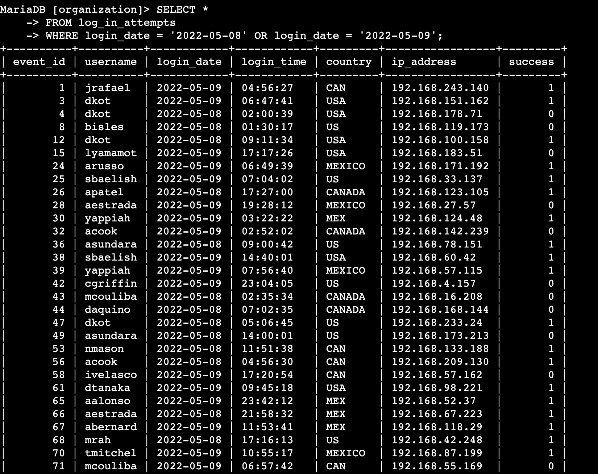
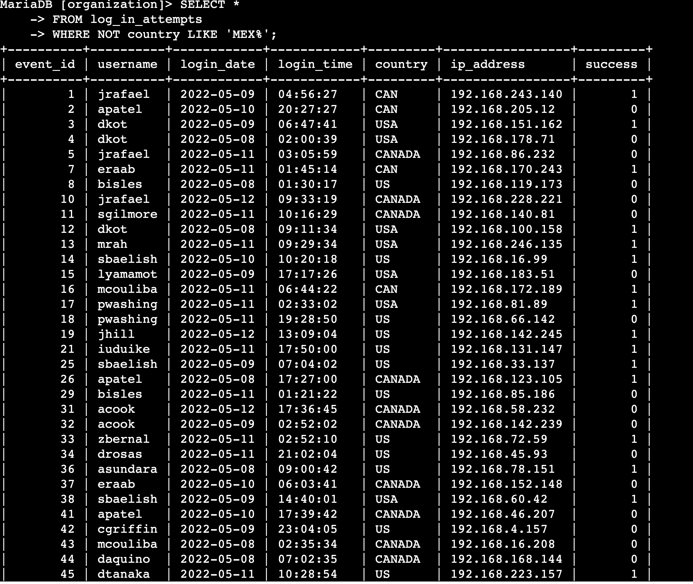
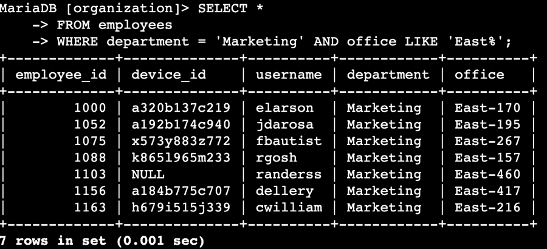
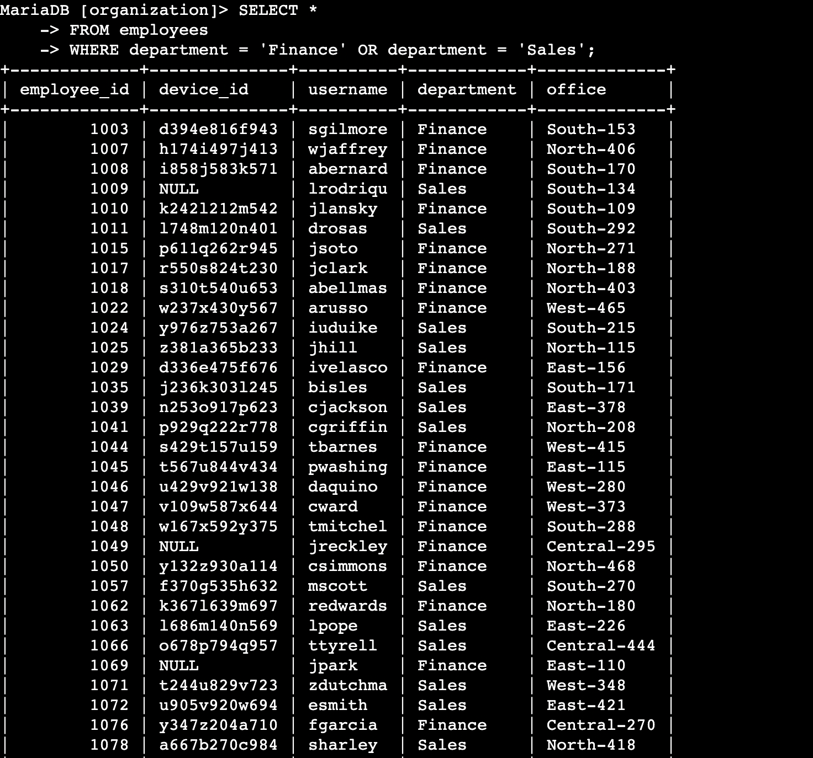

# Applying SQL Filters for Security Investigations
## Querying Login Attempts and Employee Data

| Field | Detail |
|-------|--------|
| **Analyst** | Amal Shaji |
| **Environment** | SQL — MySQL |
| **Tables Used** | `log_in_attempts`, `employees` |
| **Objective** | Use SQL filters to investigate potential security issues involving login attempts and employee machines |

---

## Project Description

As a security professional at a large organisation, 
two potential security issues were identified involving 
suspicious login activity and employee machine access. 
The organisation's database was queried using targeted 
SQL filters to retrieve specific datasets supporting 
the investigation.

Six queries were written across the `log_in_attempts` 
and `employees` tables, applying AND, OR, NOT, LIKE, 
and comparison operators to isolate exactly the records 
relevant to each security concern.

---

## Task 1 — Retrieve After Hours Failed Login Attempts

**Security concern:** Suspicious login activity may 
have occurred outside of normal business hours. Failed 
login attempts after 18:00 require investigation as 
they fall outside expected working patterns and may 
indicate unauthorised access attempts.
```sql
SELECT *
FROM log_in_attempts
WHERE login_time > '18:00' AND success = FALSE;
```



`login_time > '18:00'` filters for attempts occurring 
after 6pm. `AND success = FALSE` further restricts 
results to failed attempts only. Both conditions must 
be true simultaneously — the AND operator ensures only 
failed after hours attempts are returned, not all 
after hours activity and not all failed attempts 
across the full day.

---

## Task 2 — Retrieve Login Attempts on Specific Dates

**Security concern:** A suspicious event was identified 
around 2022-05-09. Login attempts on this date and the 
preceding day require review to establish full context 
around the incident window.
```sql
SELECT *
FROM log_in_attempts
WHERE login_date = '2022-05-09' OR login_date = '2022-05-08';
```



The OR operator returns records where either condition 
is true — retrieving all login activity across both 
dates regardless of success or failure. This provides 
complete visibility into the incident window without 
needing to run two separate queries.

---

## Task 3 — Retrieve Login Attempts Outside of Mexico

**Security concern:** After reviewing the data, 
suspicious activity was determined to have originated 
from locations outside of Mexico. All login attempts 
from outside Mexico require further investigation.
```sql
SELECT *
FROM log_in_attempts
WHERE NOT country LIKE 'MEX%';
```



`NOT` inverts the condition — excluding all matching 
records and returning everything else. `LIKE 'MEX%'` 
matches any country value beginning with MEX, 
accounting for both MEX and MEXICO appearing 
inconsistently in the dataset. The `%` wildcard 
matches any characters following MEX, ensuring both 
variations are captured and correctly excluded.

---

## Task 4 — Retrieve Employees in Marketing

**Security concern:** Machines used by Marketing 
department employees in East building offices require 
a specific security update. The affected employees 
need to be identified precisely before the update 
is deployed.
```sql
SELECT *
FROM employees
WHERE department = 'Marketing' AND office LIKE 'East%';
```



`department = 'Marketing'` filters for Marketing 
employees only. `AND office LIKE 'East%'` further 
restricts results to those in East building offices — 
covering East-1, East-2, East-170 and any other East 
office variations. Both conditions must be true 
simultaneously, ensuring only the specific subset 
of affected employees is returned.

---

## Task 5 — Retrieve Employees in Finance or Sales

**Security concern:** A different security update is 
required for machines used by employees in the Finance 
and Sales departments. All employees across both 
departments need to be identified in a single query.
```sql
SELECT *
FROM employees
WHERE department = 'Finance' OR department = 'Sales';
```



The OR operator returns records where either condition 
is true — retrieving all employees from both 
departments simultaneously. This is more efficient 
than running two separate queries and ensures no 
records are missed from either department.

---

## Task 6 — Retrieve All Employees Not in IT

**Security concern:** A security update needs to be 
applied to all employee machines except those in the 
Information Technology department, who manage their 
own updates independently.
```sql
SELECT *
FROM employees
WHERE NOT department = 'Information Technology';
```


`NOT` inverts the condition — excluding IT department 
employees and returning all remaining records. This 
is significantly more efficient than listing every 
other department individually using OR operators, 
and ensures no department is accidentally omitted 
from the update deployment.

---

## Summary

Six targeted SQL queries were written to support 
two security investigations — suspicious login 
activity and employee machine update requirements.

| Task | Table | Operators Used | Purpose |
|------|-------|---------------|---------|
| 1 | log_in_attempts | AND, > | After hours failed logins |
| 2 | log_in_attempts | OR | Logins on specific dates |
| 3 | log_in_attempts | NOT, LIKE | Logins outside Mexico |
| 4 | employees | AND, LIKE | Marketing East office staff |
| 5 | employees | OR | Finance and Sales staff |
| 6 | employees | NOT | All staff excluding IT |

SQL filtering allows security analysts to query 
large datasets with precision — retrieving only 
the records relevant to a specific investigation 
without manually reviewing entire tables. The 
ability to combine AND, OR, NOT, and LIKE operators 
to construct targeted queries is a core skill in 
any security investigation involving log data or 
access records.

---

*Completed by Amal Shaji — Google Cybersecurity
Professional Certificate, Course 4: Tools of the
Trade: Linux and SQL*
