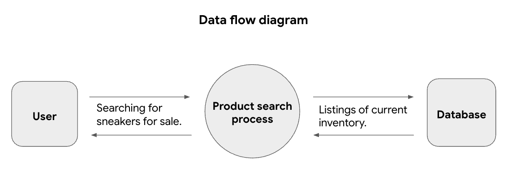
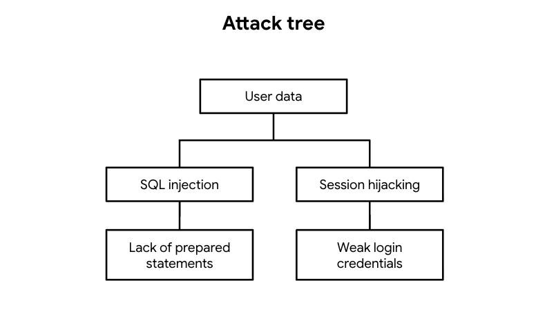

# PASTA Threat Model Analysis
## Sneaker Marketplace Mobile Application

| Field | Detail |
|-------|--------|
| **Analyst** | Amal Shaji |
| **Application** | Sneaker buying and selling mobile app |
| **Framework** | PASTA — Process for Attack Simulation and Threat Analysis |
| **Objective** | Identify security requirements and risks for a new mobile application prior to launch |

---

## Framework Overview

PASTA is a seven-stage risk-centric threat modelling
methodology that moves from business objectives
through technical decomposition to attack simulation
and control recommendations. It is designed to
align security analysis with business goals,
ensuring that identified risks are evaluated in
the context of real operational impact.

---

## Stage I — Define Business and Security Objectives

The following business requirements were identified
as core security considerations for this application:

- Users must be able to create accounts directly
or connect via external accounts as authentication
security is a foundational requirement
- The app must process financial transactions
securely across multiple payment options.
Payment data handling is a primary security
and legal concern
- The app must comply with PCI-DSS given that
it stores and processes cardholder data and
non-compliance exposes the business to
significant financial and legal liability
- User data privacy must be maintained throughout as
buyers and sellers share personal and financial
information that must be protected at rest
and in transit

---

## Stage II — Define Technical Scope

**Technologies used by the application:**

| Technology | Purpose |
|-----------|---------|
| API | Facilitates data exchange between users, sellers, payment processors, and internal systems |
| PKI — AES and RSA | AES encrypts sensitive data such as credit card information. RSA exchanges encryption keys between the app and user devices |
| SHA-256 | Hashes sensitive user data including passwords and payment information |
| SQL | Stores and retrieves product listings, seller information, and transaction data |

**Priority technology for security evaluation: API**

APIs handle the exchange of sensitive data between
users, sellers, payment processors, and internal
systems this creates a large and complex attack
surface that spans every interaction in the
application. A compromised or poorly secured API
could expose user data, payment information, and
session tokens simultaneously. The specific APIs
in use and their authentication mechanisms must
be fully understood before a comprehensive risk
assessment can be completed.

---

## Stage III — Decompose Application

**Data Flow Diagram:**

The data flow diagram shows that user requests
pass through a central product search process
before reaching the database. This layer handles
queries from users and returns current inventory
listings.

Any vulnerability in the query handling layer,
such as unsanitised SQL inputs, creates a direct
path to the underlying database. The flow confirms
that user-facing inputs feed directly into backend
database operations, making input validation and
prepared statements critical controls at this stage.

---

## Stage IV — Threat Analysis

Two primary threat types were identified based on
the technologies and data flows reviewed:

**1. Injection Attacks**
SQL injection targeting the database query layer
identified in the data flow diagram. Without input
sanitisation, an attacker can manipulate query
structures to extract, modify, or delete database
records and this can expose seller listings, buyer data,
and payment information.

**2. Session Hijacking**
An attacker intercepts or steals a valid session
token to impersonate a legitimate user thereby gaining
access to their account, purchase history, and
payment information without requiring valid
credentials. This is particularly relevant for a
mobile application where sessions may be maintained
across extended periods.

---

## Stage V — Vulnerability Analysis

Two vulnerabilities were identified that directly
enable the threats identified in Stage IV:

**1. Lack of Prepared Statements**
SQL queries constructed from unsanitised user
input are directly vulnerable to injection attacks.
Without parameterised queries, an attacker can
alter the query structure and interact with the
database in ways the application did not intend which
includes extracting all stored user and
payment data.

**2. Broken API Token Authentication**
Improperly validated, expired, or insufficiently
protected API tokens could allow unauthorised
access to protected endpoints. This enables
attackers to interact with the application's
backend systems without valid authentication and can
expose user data and enabling unauthorised
transactions.

---

## Stage VI — Attack Modelling

**Attack Tree:**

The attack tree maps two primary paths to the
high-value target which is user data:

**Path 1: SQL Injection**
Exploits the lack of prepared statements in
database queries can allow direct manipulation
of the database layer.

**Path 2: Session Hijacking**
Exploits weak login credentials to steal or
predict session tokens can allow impersonation
of legitimate users without their knowledge.

Both paths converge on the same target and
demonstrate that the application requires layered
defences addressing both the database query layer
and the authentication layer simultaneously.

---

## Stage VII — Risk Analysis and Controls

The following security controls are recommended
to mitigate the identified threats and
vulnerabilities:

| Control | Threat Addressed | How It Helps |
|---------|-----------------|-------------|
| SHA-256 hashing | Data exposure | Protects passwords and sensitive data at rest — hashed values cannot be reversed even if the database is compromised |
| Incident response procedures | All threats | Ensures rapid detection, containment, and recovery — reducing the window of exposure and limiting damage |
| Password policy | Session hijacking | Enforces strong credentials — directly mitigates weak login credential risk identified in the attack tree |
| Principle of least privilege | All threats | Limits database and API access to what each role requires — reducing blast radius of any compromised account |
| Input validation and prepared statements | SQL injection | Treats user inputs as data rather than executable query components — directly mitigates injection attacks |
| Multi-factor authentication | Session hijacking | Adds an additional authentication barrier — compromised passwords alone are insufficient to gain access |

---

## Summary

The PASTA analysis of the sneaker marketplace
application identified two primary attack paths
to user data, SQL injection via lack of prepared
statements, and session hijacking via weak login
credentials. Both paths are addressable through
a combination of technical controls at the
database and authentication layers, supported
by operational policies and incident response
procedures.

The application handles sensitive financial and
personal data requiring PCI-DSS compliance and
making these controls not just security best
practice but a regulatory obligation.

---

*Completed by Amal Shaji — Google Cybersecurity
Professional Certificate, Course 5: Assets,
Threats, and Vulnerabilities*
