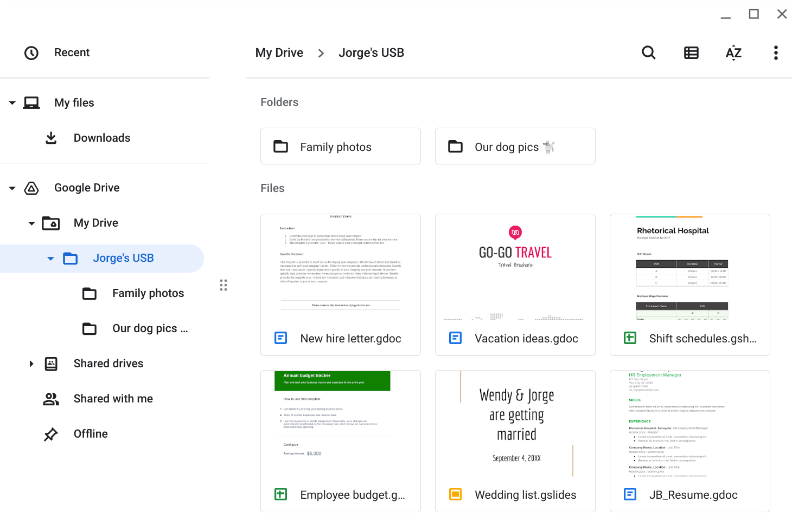

# USB Drive Attack Vector Analysis
## Physical Threat Investigation — Rhetorical Hospital

| Field | Detail |
|-------|--------|
| **Analyst** | Amal Shaji |
| **Organisation** | Rhetorical Hospital |
| **Scenario** | USB drive found in hospital car park |
| **Investigation Method** | Virtualised environment — isolated from network and other systems |

---

## Scenario Overview

A USB drive bearing the hospital's logo was
discovered in the car park. To safely investigate
the device without risking infection of company
systems, it was examined using virtualisation
software running an isolated simulated instance
of a workstation — disconnected from all other
files and networks.

The drive appeared to belong to Jorge Bailey,
the hospital's Human Resources Manager.

---

## Contents

The USB drive contains a mixture of personally
identifiable information (PII) and sensitive
organisational data. Personal files include
family and pet photos belonging to Jorge Bailey.
Work-related files include a new hire letter and
employee shift schedules, both of which contain
PII relating to hospital staff including names,
roles, and working patterns that are not intended
for public access.

---

## Attacker Mindset

The employee shift schedule provides an attacker
with detailed intelligence about hospital staff which includes 
their names, roles, and working hours. And this could be
used to craft highly targeted spear phishing
emails impersonating known colleagues or
management. Personal photos and files could be
used for social engineering attacks against Jorge
directly and can be used build a false trust through familiarity
with his personal life. The new hire letter
contains organisational information that could
help an attacker map the hospital's internal
structure and identify individuals with access
to sensitive systems.

The entire scenario may have been staged through a
deliberate USB baiting attack designed to deliver
malware or harvest credentials from whoever
plugged the device into a company workstation.

---

## Risk Analysis

**Technical Risks**

USB baiting attacks can deliver malware,
ransomware, or keyloggers that execute
automatically when a device is plugged into a
workstation could potentially compromise the
entire hospital network and exposing protected
patient health information (PHI).

**Sensitive Information at Risk**

The device contained PII belonging to Jorge
Bailey and other hospital employees which includes
shift schedules that reveal staffing patterns,
and a new hire letter that maps internal
organisational structure. This information
provides an attacker with everything needed
to conduct targeted social engineering against
individuals or the organisation as a whole.

**Recommended Controls**

| Category | Control |
|----------|---------|
| Technical | Disable AutoPlay on all company devices to prevent automatic execution of malicious code when unfamiliar media is connected |
| Technical | Implement endpoint security that scans removable media before granting access — intercepting malicious payloads before execution |
| Operational | Establish and enforce a removable media policy prohibiting staff from connecting unverified USB devices to company equipment |
| Operational | Schedule routine antivirus scans across all workstations as a baseline operational control |
| Managerial | Deliver security awareness training covering USB baiting tactics, how to identify suspicious devices, and the correct procedure for reporting found media |
| Managerial | Establish a clear incident reporting procedure so employees know exactly what to do — and what not to do — when they encounter an unfamiliar device |

---

## Key Takeaway

This incident highlights that physical attack
vectors are as significant a threat as digital
ones, particularly in healthcare environments
where staff regularly handle sensitive patient
and employee data. A USB drive left in a car
park costs an attacker nothing to deploy but
can deliver catastrophic consequences if
discovered by the wrong person.

The correct response is to investigate in an
isolated virtualised environment rather than
plugging the device directly into a connected
workstation. This is a critical first step that
prevented potential harm in this scenario.

---

*Completed by Amal Shaji — Google Cybersecurity
Professional Certificate, Course 5: Assets,
Threats, and Vulnerabilities*
