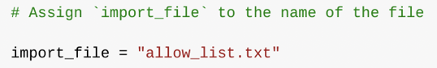
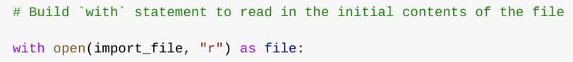
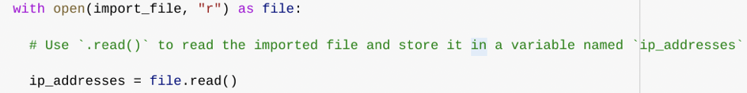
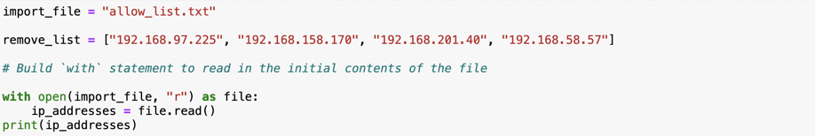
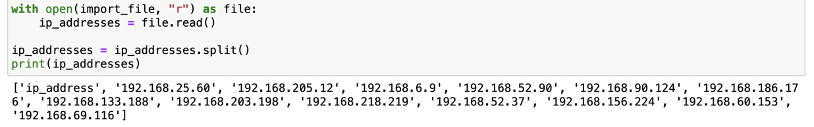
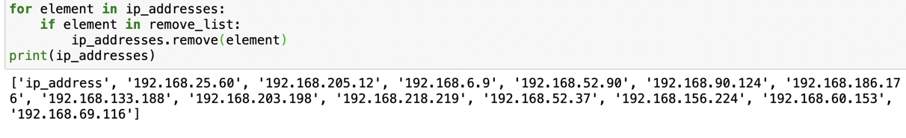
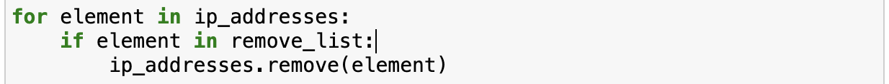
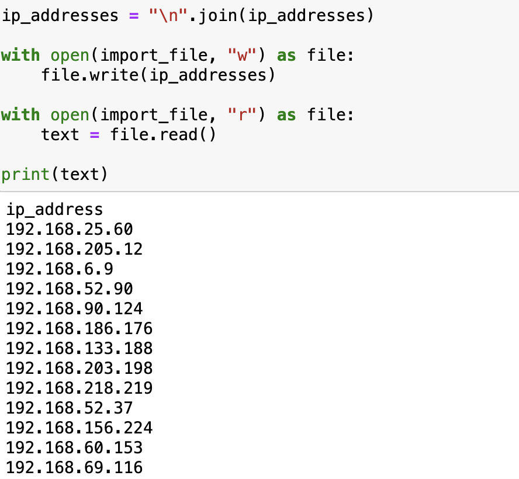

# IP Allow List Update Algorithm
## Automating Access Control Management with Python

| Field | Detail |
|-------|--------|
| **Analyst** | Amal Shaji |
| **Language** | Python |
| **File Managed** | `allow_list.txt` |
| **Objective** | Automate the removal of unauthorised IP addresses from an access control allow list |

---

## Project Description

At a healthcare organisation, access to restricted
content containing patient records is controlled
through an IP address allow list stored in
`allow_list.txt`. As employee access requirements
change, whether through role changes, departures,
or security policy updates. Their IP addresses must be
removed from this list accurately and promptly to
maintain access control integrity.

A separate remove list identifies the IP addresses
that should no longer have access to restricted
content. This algorithm automates the process of
cross-referencing the allow list against the remove
list and updating `allow_list.txt` to reflect the
current authorised access state, eliminating the
risk of manual error in a security-critical process.

---

## Complete Algorithm

```python
# Assign the allow list file name to a variable
import_file = "allow_list.txt"

# Define the list of IP addresses to remove
remove_list = ["192.168.97.105", "192.168.158.170",
               "192.168.201.40", "192.168.58.57"]

# Open the file, read contents, and process
with open(import_file, "r") as file:
    ip_addresses = file.read()

# Convert the string to a list
ip_addresses = ip_addresses.split()

# Iterate through the remove list and remove matches
for element in remove_list:
    if element in ip_addresses:
        ip_addresses.remove(element)

# Convert the list back to a string
ip_addresses = "\n".join(ip_addresses)

# Write the updated list back to the file
with open(import_file, "w") as file:
    file.write(ip_addresses)
```

---

## Step-by-Step Explanation

### Step 1 — Open the File Containing the Allow List





The file name `"allow_list.txt"` is first assigned
as a string to the variable `import_file`. This
separates the file name from the logic that operates
on it — making the algorithm easier to maintain and
adapt if the file name changes.

The `with` statement is then used alongside the
`open()` function to open the file in read mode.
The `open()` function takes two parameters, the
file to open (`import_file`) and the mode (`"r"`
for read). The `as` keyword assigns the open file
object to the variable `file` for use within the
`with` block.

The `with` statement handles resource management
automatically and the file is closed cleanly when
execution exits the block, regardless of whether
an error occurs. This prevents resource leaks and
is considered best practice for file handling in
Python.

---

### Step 2 — Read the File Contents





Within the `with` block, the `.read()` method is
called on the `file` object to read the entire
contents of `allow_list.txt` into memory as a
single string. This string is stored in the variable
`ip_addresses`.

Reading the file contents into a string is the
necessary first step before any manipulation can
occur. The string representation allows the data
to be inspected, split, and processed using Python's
string and list methods.

---

### Step 3 — Convert the String Into a List




To enable individual IP address removal, the
`ip_addresses` string must be converted to a list.
The `.split()` method is applied to `ip_addresses`
to achieve this.

By default, `.split()` divides a string on
whitespace, which matches the formatting of the
allow list file where each IP address is separated
by a newline or space. The result is a list where
each element is a single IP address. The output is
reassigned back to `ip_addresses`, replacing the
string with the list representation.

This conversion is essential because the `.remove()`
method used in the next step operates on lists and
not strings.

---

### Step 4 — Iterate Through the Remove List



A `for` loop is used to iterate through each
element in `remove_list`. The `for` keyword
initiates the loop, followed by the loop variable
`element` and the `in` keyword, which instructs
Python to assign each value from `remove_list`
to `element` in turn across each iteration.

This iterative structure ensures that every IP
address in the remove list is evaluated against
the allow list, regardless of how many addresses
need to be removed. The algorithm scales to any
size remove list without modification.

---

### Step 5 — Remove IP Addresses on the Remove List



Within the body of the `for` loop, a conditional
statement first checks whether the current loop
variable `element` exists in `ip_addresses` before
attempting removal. This guard clause is necessary
— calling `.remove()` on a value that does not
exist in the list raises a `ValueError` and
terminates the algorithm.

If the condition evaluates to `True`, the `.remove()`
method is called on `ip_addresses` with `element`
passed as the argument, removing the first
occurrence of that IP address from the list.

This approach is valid here because `ip_addresses`
contains no duplicate entries and each IP address
appears at most once, so a single `.remove()` call
per iteration is sufficient to fully clean the list.

---

### Step 6 — Update the File With the Revised List



Before the updated list can be written back to the
file, it must be converted from a list back to a
string. The `.join()` method is applied to the
newline character `"\n"` with `ip_addresses` passed
as the argument. This produces a single string where
each IP address is separated by a newline, matching
the original file format.

A second `with` statement then opens `allow_list.txt`
in write mode which is indicated by `"w"` as the second
argument to `open()`. Write mode overwrites the
entire existing file content with the new data.

The `.write()` method is called on the file object
with `ip_addresses` passed as the argument to write on
the updated, cleaned string directly to
`allow_list.txt`. The restricted content will now
be inaccessible to any IP addresses that were
present on the remove list.

---

## Summary

This algorithm automates the removal of unauthorised
IP addresses from an access control allow list,
a security-critical task that, if performed manually,
is prone to human error and difficult to audit.

The algorithm works through seven logical steps:
opening `allow_list.txt` using a `with` statement
and `open()` in read mode; reading the file contents
into a string using `.read()`; converting that string
to a list using `.split()`; iterating through the
remove list using a `for` loop; conditionally
removing matching IP addresses using `.remove()`;
converting the updated list back to a string using
`.join()`; and finally writing the revised content
back to the file using a second `with` statement
and `.write()` in write mode.

The use of a conditional before `.remove()` ensures
the algorithm handles edge cases gracefully without
raising errors. The `with` statement pattern
guarantees clean file handling at both the read and
write stages. Together these components produce a
robust, readable, and maintainable security
automation script.

---

*Completed by Amal Shaji — Google Cybersecurity
Professional Certificate, Course 7: Automate
Cybersecurity Tasks with Python*
